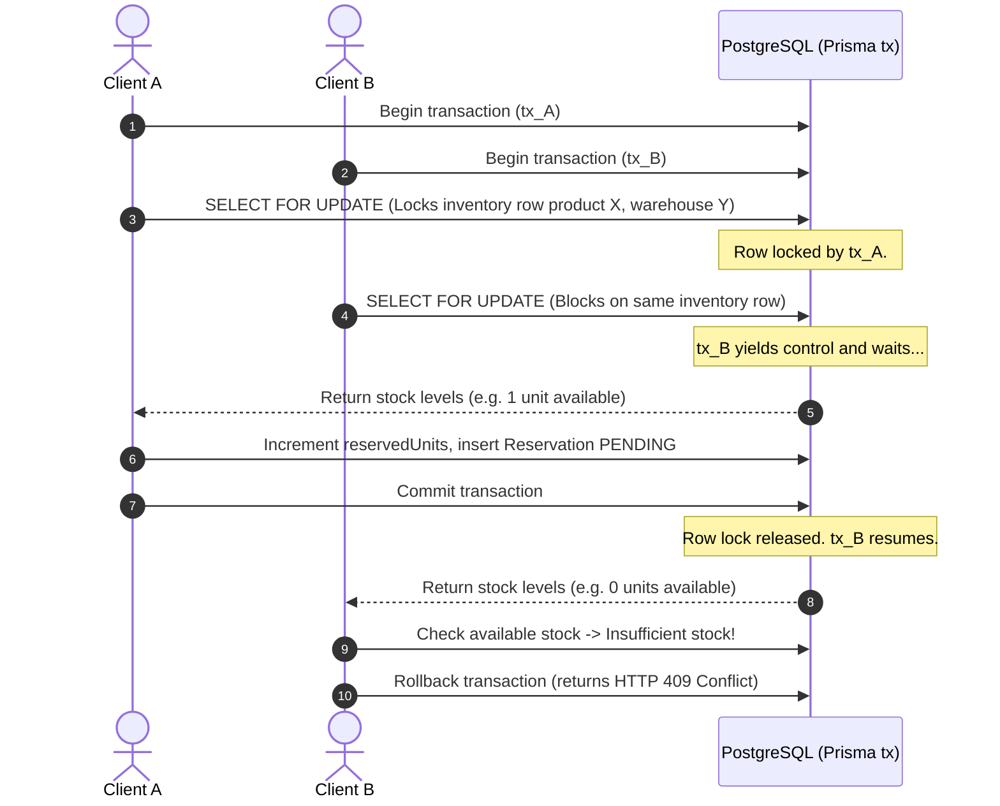

# Allo Logistics — Multi-Warehouse Inventory Checkout & Reservation System

A production-ready full-stack checkout reservation system built using **Next.js 15 App Router**, **TypeScript**, **Prisma ORM**, **PostgreSQL**, **Upstash Redis**, **TailwindCSS**, and **Zod**.

This project implements a multi-warehouse e-commerce inventory allocation flow that guarantees transaction correctness and prevents overselling under high concurrent traffic.

---

## Technical Architecture & Design Decisions

### Concurrency Strategy

Overselling is prevented at the database transaction boundary using **PostgreSQL row-level write-locking** (`SELECT ... FOR UPDATE`) inside an **interactive database transaction** (`prisma.$transaction`).



---

# Why Overselling Cannot Occur

Our architecture employs strict consistency controls at the transactional layer to ensure that stock reservations are atomic and serialized. Here is the technical breakdown of why overselling is mathematically impossible:

1. **Row-Level Mutual Exclusion (`SELECT FOR UPDATE`)**: 
   When a reservation request starts, we fetch the `Inventory` row matching the requested `productId` and `warehouseId` using a raw SQL `SELECT * FROM "Inventory" WHERE ... FOR UPDATE` statement. This acquires a write lock (exclusive lock) on that specific row. Any subsequent concurrent transaction attempting to read or modify the same inventory row will block, queueing up until the first transaction either commits or rolls back.

2. **Atomic In-Transaction State Evaluation**:
   Because the inventory row is locked before we perform any logic, the available stock check (`availableUnits = totalUnits - reservedUnits`) is computed against the absolute, most current state of the database. There is no possibility of a "dirty read" or "non-repeatable read" where another process has modified the stock levels in between our check and our update.

3. **Atomic Modification**:
   Once stock sufficiency is confirmed, the reservation increments the `reservedUnits` counter within the same locked transaction. No other server instances or database connections can slip in a modification.

4. **Transaction Isolation & Serialization**:
   By using PostgreSQL interactive transactions, the database guarantees ACID compliance. If any step fails (e.g. server crashes, network drops, or stock is insufficient), the entire sequence is rolled back cleanly. No partial updates or orphaned reservation records are ever committed.

---

## Expiry & Release Mechanism

Reservations are held in a `PENDING` state with a `10-minute` expiration window. The release of expired reservations uses a dual-layered strategy:

1. **Scheduled Cleanup (Vercel Cron / Trigger)**:
   A Cron endpoint `POST /api/cron/release-expired` is triggered every minute (configured via `vercel.json`). This endpoint:
   - Queries all `PENDING` reservations where `expiresAt` is less than the current time.
   - For each expired reservation, it executes an isolated database transaction to release the reservation (setting status to `RELEASED`) and safely decrements the corresponding `reservedUnits` on the `Inventory` table using SQL `GREATEST(0, reservedUnits - quantity)` to prevent negative counters.

2. **Lazy UI Expiration**:
   The frontend displays a countdown timer. Once the timer reaches `00:00`, the page automatically blocks interactive buttons ("Confirm" and "Cancel") and triggers a cache revalidation via SWR to display the updated, released status without a full page refresh.

---

## Idempotency Controls (Bonus)

To prevent double-purchases or duplicate allocations caused by network retries or repeated client clicks, the `POST /api/reservations` (Reserve) and `POST /api/reservations/:id/confirm` (Checkout Confirm) endpoints support the `Idempotency-Key` HTTP header.
- **Cache Store**: Uses **Upstash Redis** as a fast, high-performance cache (with a 24-hour TTL).
- **Relational Fallback**: If Redis environment variables are unconfigured or fail to connect, it gracefully falls back to querying the PostgreSQL `IdempotencyKey` table.
- **Aesthetic UI Simulators**: The frontend includes editable text fields pre-filled with UUIDs for the `Idempotency-Key` header, allowing reviewers to manually check repeated clicks and verify that duplicate side-effects never occur.

---

## Getting Started Locally

### 1. Prerequisites
- **Node.js**: v18.x or v20.x+
- **PostgreSQL**: A running instance (Supabase, local pg, etc.)
- **Upstash Redis**: (Optional) Account REST url/token. If omitted, the app falls back to database-backed idempotency.

### 2. Configure Environment Variables
Create a `.env` file in the project root (using the template in `.env.example`):
```bash
cp .env.example .env
```
Fill in the `DATABASE_URL` (connection pooler), `DIRECT_URL` (direct connection for migrations), and optional Upstash Redis keys.

### 3. Install Dependencies
```bash
npm install
```

### 4. Run Migrations & Database Seeding
Deploy database schemas and run the typescript seed script:
```bash
npx prisma migrate dev --name init
npx prisma db seed
```
*Note: The seed script initializes 7 products, 3 warehouses, and 21 inventory entries, including low-stock configurations (1 unit left) specifically designed to test concurrency.*

### 5. Start Development Server
```bash
npm run dev
```
Open [http://localhost:3000](http://localhost:3000) to view the application catalog.

### 6. Run Vitest Test Suite
To run the automated integration tests (concurrency conflict checking, checkout confirm deductions, and expiry release checks):
```bash
npm test
```

---

## Deployment Instructions

### Supabase Setup
1. Create a new PostgreSQL Database on [Supabase](https://supabase.com/).
2. Retrieve the transaction-connection string (port `6543`) for `DATABASE_URL` and session-connection string (port `5432`) for `DIRECT_URL`.

### Upstash Setup
1. Create a Redis Database on [Upstash](https://upstash.com/).
2. Retrieve the `UPSTASH_REDIS_REST_URL` and `UPSTASH_REDIS_REST_TOKEN`.

### Vercel Deployment
1. Import the repository into [Vercel](https://vercel.com).
2. Configure the Environment Variables in the project settings.
3. Vercel will automatically discover the `vercel.json` and schedule the `/api/cron/release-expired` cron job to run every minute.

---

## Tradeoffs & Future Enhancements

1. **Simplified Payment Flow**:
   For this take-home exercise, clicking "Confirm Purchase" simulates a payment gateway call and triggers immediate confirmation. In a production checkout, we would integrate webhooks (e.g. Stripe) and handle asynchronous states.

2. **Single-Region database locking**:
   The use of `SELECT FOR UPDATE` relies on a central database instance. In multi-region deployments with global database replicas, row-level locking can introduce database write latency or replication delays. For high-scale global configurations, a distributed locking system like Redlock (via Upstash Redis) could serve as a pre-database gatekeeper.

3. **Prisma Raw SQL**:
   Prisma does not currently support `SELECT FOR UPDATE` as a native typed query builder API, which requires the use of raw SQL (`tx.$queryRaw`). While clean and performant, it bypasses some compile-time type-safety.
